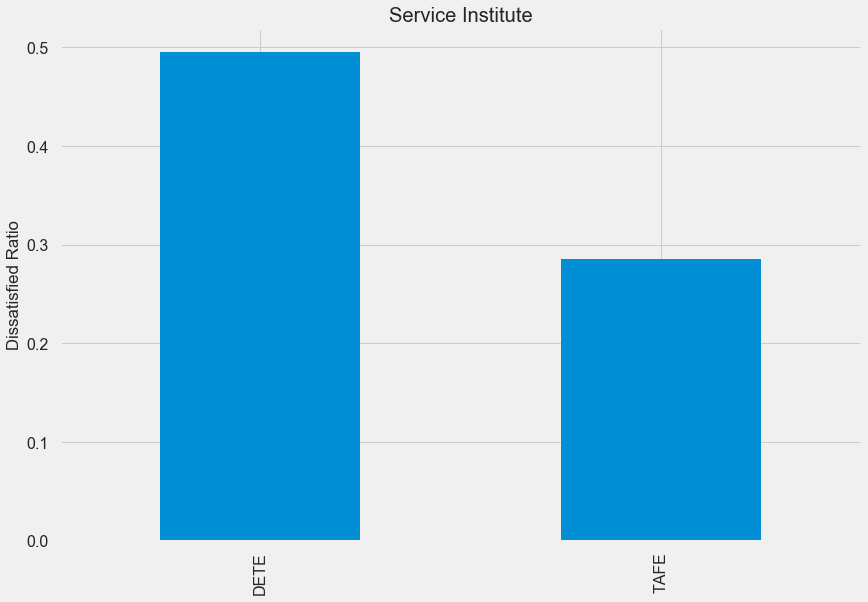

Jupyter Notebook
README
Last Checkpoint: 26 minutes ago
(autosaved)
Current Kernel Logo
Python 3 
File
Edit
View
Insert
Cell
Kernel
Widgets
Help

# Using Pandas to Clean and Analyze Employee Exit Surveys
​
  
## INTRODUCTION
This project involved working with exit surveys from the employees of the [Department of Education, Training and Employment](https://en.wikipedia.org/wiki/Department_of_Education_and_Training_(Queensland)) (DETE) and the [Technical and Further Education](https://en.wikipedia.org/wiki/Technical_and_further_education) (TAFE) institute in Queensland, Australia. Our main goal was to clean and transform the data to help answer the following questions -  
   1. Are employees who worked for a short time resigning due to some kind of dissatisfaction? What about employees who have worked there longer? 
    
   2. Are younger employees resigning due to some kind of dissatisfaction? What about older employees? 
    
​
​
## DATA
The DETE exit survey can be found [here](https://data.gov.au/dataset/ds-qld-89970a3b-182b-41ea-aea2-6f9f17b5907e/details?q=exit%20survey), and exit survey for TAFE [here](https://data.gov.au/dataset/ds-qld-89970a3b-182b-41ea-aea2-6f9f17b5907e/details?q=exit%20survey). A slightly modified version of the two datasets (encoding changed from cp1252 to UTF-8) was already provided to us by [DataQuest](https://www.dataquest.io/) as `dete_survey.csv` and `tafe_survey.csv`.   
The` dete_survey` dataframe contains 822 entries and 56 columns. Every other column except `Id` is object or boolean datatype. The missing values in the data are filled as _`Not Stated`_ . Below is a preview of a couple columns we used rom the dete_survey.csv: 
​
`SeparationType`: The reason why the person's employment ended 
`Cease Date`: The year or month the person's employment ended 
`DETE Start Date`: The year the person began employment with the DETE 
`Job dissatisfaction`: Whether job dissatisfaction was the reason for separation 
​
The `tafe_survey` dataframe has 702 entries with 72 columns and all columns with the exception of `Record ID ` and `CESSATION YEAR` are object data types. Below is a preview of some of the columns we worked with: 
​
`Contributing Factors. Job Dissatisfaction`: Whether job dissatisfaction was one of the contributing factors for ending employment. 
`Reason for ceasing employment`: The reason why the person's employment ended 
`LengthofServiceOverall. Overall Length of Service at Institute (in years)`: The length of the person's employment (in years)
 
​
​
​
## TECHNOLOGIES AND TECHNIQUES
Our end goal was to combine both the surveys and answer the questions mentioned above. Even though both the surveys were designed using the same template, one of them had customized some of its answers. As a data dictionary wasn't provided with the dataset, we used common knowledge to combine and clean some of the columns. Below are the steps we took to prepare the data for analysis - 
 
- Dropped columns that were not necessary for this particular analysis, for e.g., `Aboriginal`, `Torres Strait`, `South Sea` in dete_survey dataframe and `Workplace. Topic:Would you recommend the Institute as an employer to others?` in tafe_survey dataframe among others.
- Filtered the data to only show information of employees that had resigned. We cleaned and renamed some of the columns in both dataframes.
- Cleaned and standardized column names required for our analysis. The table below shows the columns we were intereseted in:  
​
| dete_survey | tafe_survey | Definition | New Name |
|-----------------|----------------------------------------------------------------------------|---------------------------------------------------------|--------------------------|
| SeparationType | Reason for ceasing employment | The reason why the participant's employment ended | separationtype |
| Cease Date | CESSATION YEAR | The year or month the participant's employment ended | cease_date |
| DETE Start Date |  | The year the participant began employment with the DETE | dete_start_date |
|  | LengthofServiceOverall. Overall Length of Service at Institute (in years)  | The length of the person's employment (in years) | institute_service |
| Age | CurrentAge. Current Age | The age of the participant | age |
| Gender | Gender. What is your Gender? | The gender of the participant | gender |
 
​
- Added a new column `institute_service` in dete_survey (`cease_date - start_date`) to calculate the number of years the employee had worked in the organization. A similar column already existed for tafe_survey.
- Combined the data, handled missing values and cleaned columns required for analysis.
​
​
## CONCLUSIONS
 
​
|   |   |
|----|----|
||  |
| |  |
​
  
  
Organized and cleaned employee exit survey data from the Department of Education, Training and Employment(DETE) and the Technical and Further Education (TAFE) institute in Queensland, Australia.
​
The following observations were made -
​
* Dissatisfactin was more prevelant in employees with over 7 years of experience, with 51% of them resigning over it.
* Employees over 60 years of age were 52% more dissatisfied at the time of leaving compared to only 37% of employees between the age of 21-30.
* Both male and female employees were equally likely to resign due to dissatisfaction, percentage of males being slightly higher(42%) compared to females (37%).
* DETE employees (49%) showed higher dissatisfaction compared to TAFE employees (28%) at the time of resignation. 
* Majority of the dissatisfied ex-employees worked in teaching jobs(including 'Teacher', 'Teacher Aide', 'Guidance Officer' and 'Tutor') and had been hired as permanent employees.
  
Based on the above findings, it was recommended that further survey be done on 'experienced' and 'veteran' employees in permanent teaching jobs to assess the reasons for employee dissatisfaction and ways to improve it.
​
​
## FUTURE ANALYSIS
In this project, we grouped dissatisfied employees based on their position in the institutes and demographic features. Future analysis can take into account `WorkUnit Views` and `Institute Views` to see if any specific feature or features stands out as highly disagreeable. This may help us further pinpoint the reason as to why the employees are dissatisfied. For e.g., were the dissatisfied employees not happy with the opportunities for growth or work-life balance, etc. 
​
​
## WHAT I LEARNED
* Data extraction, cleaning and organization are a very important part of the data science process. 
* How to use pivot tables to summarizes data in a meaningful way.
* Combining datasets
​
